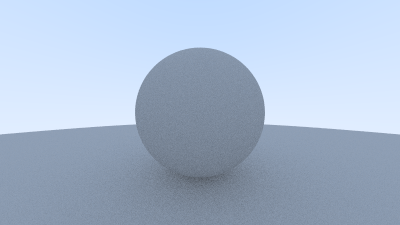

# Raytracing in Nim
This is my implementation of [Ray Tracing in One Week-end](https://raytracing.github.io/books/RayTracingInOneWeekend.html).

I've never coded in [Nim](https://nim-lang.org/) and thus thought a simple raytracer would be a cool first project to learn the language. Since this is my first time writting Nim ever, please be aware that some of that code might be unoptimized, inelegant and sometime even wrong. If you spot any mistake, [open an issue](https://github.com/brayevalerien/Raytracing-in-Nim/issues) to help!

> [!NOTE]  
> This repo only contains the source code for the current status of the renderer. However, you can go back through the commits to see the code for most of the chapters.

# Installation and usage
Assuming you already have [Nim](https://nim-lang.org/) installed on your computer, run the following commands to get the project and run it.
```bash
git clone https://github.com/brayevalerien/Raytracing-in-Nim
cd Raytracing-in-Nim
nim c -r main.nim
```

The rendered image will be saved as `output.ppm`.

For the moment, the image should look like this:


